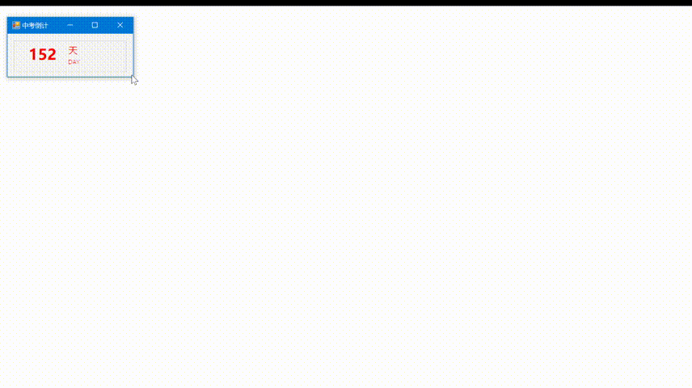

# Exam Countdown

A countdown program.

> [Log Infinity Project](https://github.com/LogCreative/LogInfinity) Memory Box
> 
> (LC) Log Creative 2014



## Repository Structure

```
ExamCountdown
    |-中考倒计 Main Program
    |-Help.rtf Help Documentation
```

You can find the release version of this program in the [Release Page](https://github.com/LogCreative/ExamCountdown/releases).

You can also get the help documentation on the [Wiki Page](https://github.com/LogCreative/ExamCountdown/wiki).

## Objective

- This program provides a way to make a **customized countdown interface** and **control the window precisely** through inputing numbers and numerous shortcuts.
- This program creates **a primitive way to create responsive user interface** by assigning size levels manually. More precisely speaking, it has four different levels of display modes for displaying different components on the program.
- This program shows how to use Visual Basic **to read and edit Rich Document File**(.rtf) through a basic user interface.
- This program **integrates media controls** so that it can be shutdown with an assigned time limit based on the native shutdown countdown function.

## Compilation

It is not so popular for Windows x64 architecture at the time when this program is produced. To avoid error messages on dependencies, you need to switch the target platform to `x86` when nessesary.

Also, the original acquired version of .NET Framework is 3.5, which causes runtime error on modern Windows 10 system due to dependency version inconsistency. In order to compile more smoothly, I switched the required version to `4.0`, which will meet the demand perfectly.

I used .NET Framework 3.5 because it will also run well on Windows XP, but Microsoft suspended the support of that OS version years before. This also make the compilation obstacle sense.

Use `100%` scaling to open Visual Studio, otherwise it will damage the vbproj file inevitible so that the control cannot be displayed in a correct scaling.

## Copyright

Log Creative 2021 redist version with MIT License.

(LC) Log Creative 2014 for collective use.